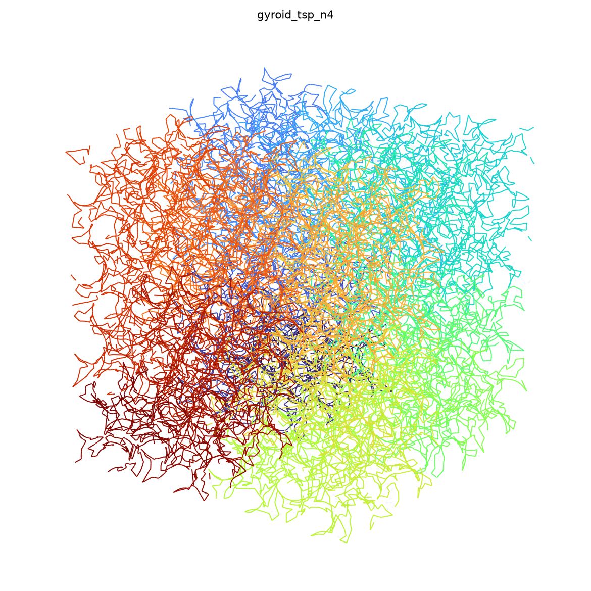
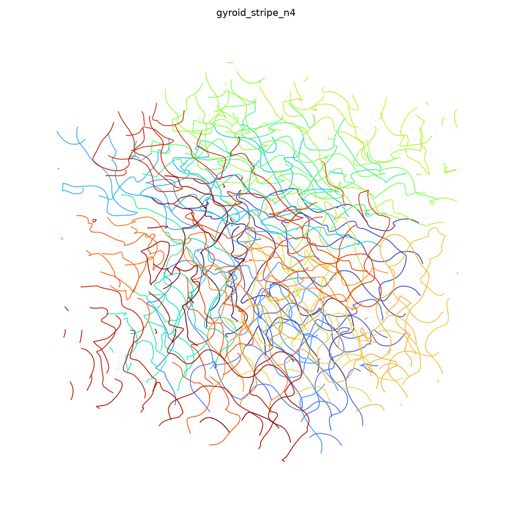

# Homogeneous surface-filling curve on a gyroid block

A generative-art pipeline that produces **one continuous polyline** living on the
[Schoen gyroid](https://en.wikipedia.org/wiki/Gyroid) surface and filling an
`N×N×N` block of unit cells with a globally homogeneous meander whose
large-scale progression follows a 3-D Hilbert sweep.

| TSP method — strong Hilbert sweep | Stripe method — homogeneous texture |
|---|---|
|  |  |

*(Curve coloured by global arclength: the colour gradient is the Hilbert sweep.)*

> This is generative art / visualization. The trigonometric gyroid is **not** the
> true minimal surface (its mean curvature only oscillates about zero); no claim
> of minimality, FEM fidelity, or physical accuracy is made.

---

## The idea (one paragraph)

Do **not** solve a curve per cell and stitch — that produces a patchwork whose
texture breaks at every cell face. Homogeneity is a *global field-coherence*
property. So we evaluate **one global gyroid field** over the whole block (a
single continuous, uniformly-handed surface), build **one direction + phase field
over the entire block at once**, and extract **one connected curve** from it. The
3-D Hilbert curve is **demoted from router to guidance field**: a low-frequency
bias that makes the single curve *progress* through the block in Hilbert order
while *filling* locally like a uniform texture. **Two frequencies, one curve.**

## Pipeline

```
Stage A  global periodic block mesh   (gyroid.py, mesh_stageA.py)
Stage B  Hilbert guidance field       (hilbert_stageB.py)
Stage C  stripe direction + phase     (direction_field.py, stripe_stageC.py)   [stripe]
Stage D  single-curve isoline extract (extract_stageD.py)                      [stripe]
Stage D' global Hilbert-biased TSP    (tsp_stageDp.py)                         [tsp]
Stage E  export + render              (output_stageE.py)
```

`pipeline.py` orchestrates; `gyroid.py`'s `phi`/`grad_phi` are the single source
of truth for every projection, normal and tangent frame.

## Two methods

* **`tsp`** — Blue-noise (Poisson-disk) sample the whole surface at radius
  `delta`, then build one open tour ordered by **Hilbert cell** (NN within each
  cell, adjacent cells joined by nearest endpoints). Because consecutive Hilbert
  cells are spatially adjacent, the tour sweeps the block in Hilbert order with
  homogeneous density. **Robust, and gives the clearest Hilbert sweep** — this is
  the recommended starting point.

* **`stripe`** — Implements the *Stripe Patterns on Surfaces* approach
  (Knöppel, Crane, Pinkall, Schröder, SIGGRAPH 2015). A smooth unit **line
  field** is built on the whole mesh, biased toward the tangential Hilbert field
  with strength `lambda_guide` (structure-tensor smoothing). A **phase** `θ` is
  then solved so it advances at frequency `omega` along that field; the isoline
  `arg(ψ)=0` is the space-filling texture, extracted per-triangle (continuous by
  construction) and spliced into one curve with short Hilbert-ordered bridges.
  Two phase solvers are available: a robust least-squares Poisson solve
  (`linear`, default) and the full complex Knöppel eigenproblem (`eigen`).
  **Gives the most beautiful homogeneous texture**; the global Hilbert sweep is
  weaker because the Hilbert direction field is curly (see *Limitations*).

## The two knobs that define the look

* **`omega`** (stripe) / **`delta`** (tsp) — how *fine* the meander is (density),
  independent of routing.
* **`lambda_guide`** — how strongly the curve marches in Hilbert order vs. wanders
  smoothly. *Low = organic, globally aimless but homogeneous; high = clearly
  Hilbert-directed.* This is the heart of the aesthetic.

## Usage

```bash
pip install -r gyroid_curve/requirements.txt

# clearest Hilbert sweep:
python run_gyroid.py --method tsp --N 4 --delta 0.5

# homogeneous stripe texture:
python run_gyroid.py --method stripe --N 4 --omega 3 --lambda-guide 2

# fast smoke test:
python run_gyroid.py --preset preview
```

Outputs (in `output/`): the single curve as `.obj` (polyline), `.ply`, `.csv`
(with arclength), the Stage-A block mesh `.obj`, an interactive **three.js**
`.html` viewer (orbit/zoom, curve coloured by arclength + translucent surface),
and a matplotlib `.png` still.

Programmatic:

```python
from gyroid_curve import Config, run_pipeline
res = run_pipeline(Config(method="tsp", N=4, delta=0.5))
curve = res["curve"]          # (n, 3) ordered polyline on phi == 0
```

## Tests

```bash
python -m pytest gyroid_curve/tests -q
```

The suite encodes the spec's acceptance criteria: analytic gradient vs. finite
difference, field periodicity, surface reprojection, mesh on-surface residual and
triangle quality, Hilbert-curve validity (unique cells, unit steps) and field
continuity, single-connected on-surface curves, Hilbert monotonicity of the TSP
tour, and direction-field/guidance alignment.

## Implementation notes & limitations

* **Periodicity.** True opposite-face welding into a closed 3-torus needs a
  periodic mesher (the spec's recommended `CGAL Periodic_3_mesh_3`), which is not
  available here; skimage marching cubes does not emit boundary-plane vertices
  symmetrically. We therefore keep the block as an **open** surface in ℝ³ (so all
  metric operations stay Euclidean and correct) with boundary-face vertices
  pinned in-plane; `periodicity_residual()` reports the opposite-ring mismatch.
  A `weld=True` option folds the seam into a torus for periodic-aware downstream
  code.
* **Triangle quality.** Marching cubes leaves a small fraction (~5 %) of slivers
  at the open faces; cotan weights are clamped (and negatives zeroed) so the
  field solves stay well conditioned. A `pymeshlab` isotropic-remesh path exists
  but is unstable on the gyroid's thin double walls, so it is not the default.
* **Hilbert sweep in the stripe method.** Making the *phase* globally
  Hilbert-monotone is limited by the curl of the Hilbert direction field (the
  1-form `ω·τ·dx` is far from integrable). The `tsp` method achieves the strong
  sweep directly; the `stripe` method excels at homogeneous texture. This matches
  the spec's framing of `lambda_guide` as a dial rather than a guarantee.

## Stretch goals (documented, not implemented)

True-minimality relaxation (mean-curvature flow toward the actual Schoen G),
multi-frequency/dithered stripes, and curvature/arclength-driven curve tubing.
